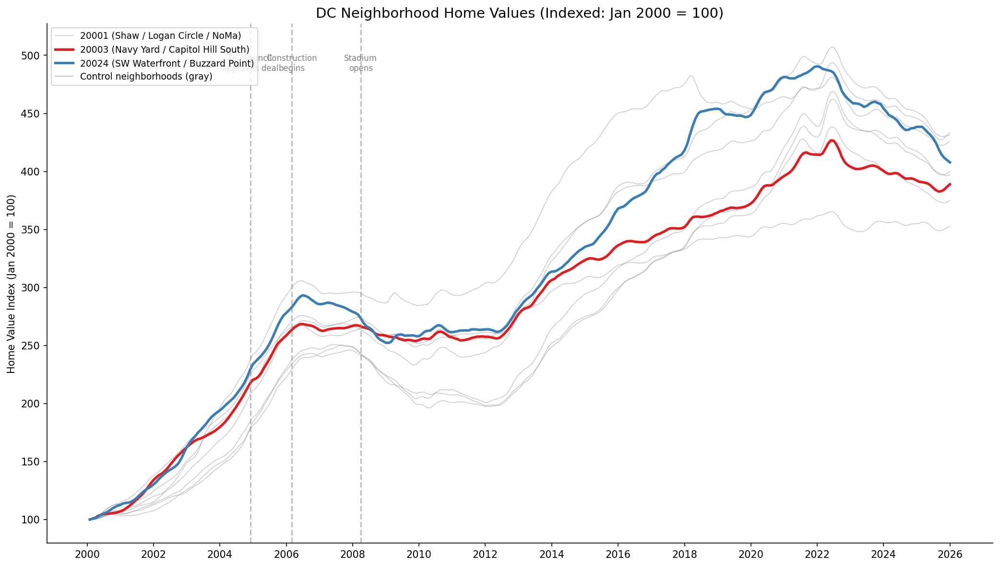
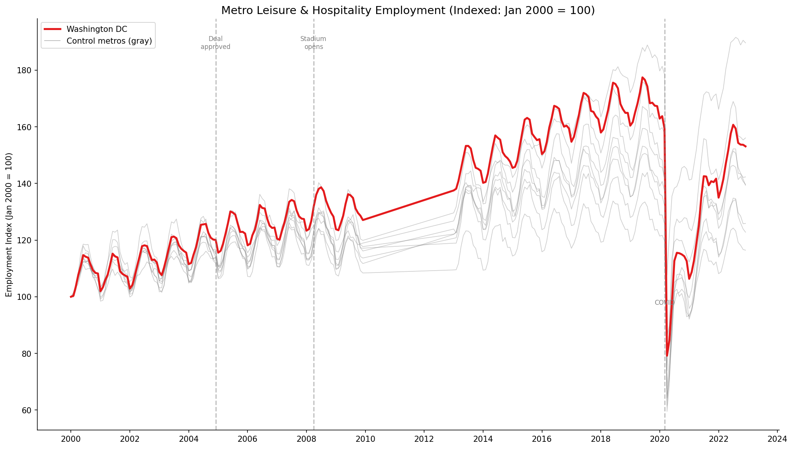

# Did DC's $611M Nationals Park Investment Pay Off?

Testing the official economic promises of Washington DC's Nationals Park using **Bayesian Causal Impact analysis** — and finding a more complicated answer than either side claimed.

## The Story

In 2004, Washington DC approved a deal to spend up to $611 million to build a new baseball stadium for the Washington Nationals. Mayor Anthony Williams and proponents promised the stadium would be an economic catalyst: **3,500 new jobs**, **$28.5 million in annual tax revenue**, and a **"rebirth of the waterfront"** in the Navy Yard neighborhood.

In 2007, I co-authored a [report for the District Economic Empowerment Coalition](references/DEEC_Broken_Promises_Big_Losses_2007.pdf) documenting how the stadium's construction had already failed to deliver — not a single contractor out of 56 met all four Project Labor Agreement requirements for hiring DC residents.

Nearly 20 years later, I return to the question with modern causal inference methods: **Did the broader economic promises come true?**

## Methodology

This project applies **CausalImpact**, a Bayesian Structural Time Series (BSTS) method developed by [Brodersen et al. (2015) at Google](https://projecteuclid.org/euclid.aoas/1430564740), to construct a **synthetic counterfactual** — a prediction of what would have happened to DC's economic indicators if the stadium had never been built. The model learns relationships with carefully selected control units during the pre-intervention period, an approach I've used professionally for policy evaluation and program measurement in corporate settings.

The key advantage: rather than simply comparing "before vs. after," CausalImpact accounts for broader economic trends (the Great Recession, national growth patterns) by using controls that experienced those same trends but *without* a stadium. Control group selection — choosing comparable metros and gentrifying neighborhoods that isolate the stadium's effect — is where the econometric judgment matters most.

## Two Analyses, Two Claims Tested

### Analysis 1: Property Values — "Rebirth of the Waterfront"

**Claim**: The stadium would catalyze neighborhood revitalization in the Navy Yard area.

**Method**: Monthly Zillow Home Value Index (acquired via Zillow Research) for Navy Yard zip codes vs. other gentrifying DC neighborhoods (Shaw, Columbia Heights, H Street, Petworth, etc.) that experienced similar revitalization *without* a stadium.


*Navy Yard (red) and SW Waterfront (blue) vs. control neighborhoods (gray), indexed to Jan 2000 = 100.*

**Key Findings**:

| Treatment Zip | Intervention Point | Estimated Effect | 95% CI | p-value |
|---|---|---|---|---|
| 20003 (Navy Yard) | Deal approval (Dec 2004) | +6.8% | [+4.7%, +9.2%] | < 0.001 |
| 20024 (SW Waterfront) | Deal approval (Dec 2004) | +3.1% | [+0.8%, +5.4%] | < 0.001 |
| 20003 (Navy Yard) | Stadium opening (Mar 2008) | **-2.5%** | [-5.1%, -0.1%] | 0.02 |

**Interpretation**: There's a modest **anticipation effect** — property values rose about 7% more than comparable neighborhoods between the deal announcement and 2019. But when measuring from the actual stadium *opening*, the effect turns **negative**. The speculation and development signal came before the stadium opened. The stadium itself didn't provide additional lift beyond what the broader DC gentrification wave was already delivering to similar neighborhoods.

### Analysis 2: Employment — "3,500 New Jobs"

**Claim**: The stadium would create 3,500 jobs and generate $28.5M in annual tax revenue.

**Method**: Monthly BLS Leisure & Hospitality employment (pulled via BLS API) for DC metro vs. 8 comparable metro areas (Baltimore, Philadelphia, Boston, Pittsburgh, St. Louis, Richmond, Nashville, Columbus).


*DC metro (red) vs. control metros (gray), indexed to Jan 2000 = 100.*

**Key Findings**:

| Intervention Point | Estimated Effect | 95% CI | p-value |
|---|---|---|---|
| Stadium opening (Mar 2008) | +2.65% (~7,800 jobs) | [+1.8%, +3.5%] | < 0.001 |
| Deal approval (Dec 2004) | +1.04% (~3,000 jobs) | [+0.3%, +1.9%] | < 0.001 |

**Interpretation**: DC's leisure & hospitality sector did grow about 2.6% more than comparable metros after the stadium opened — roughly 7,800 additional jobs in the sector. However, this represents the *entire DC metro area*, not just stadium-related jobs. DC was also experiencing broader tourism and population growth driven by federal spending, a booming restaurant scene, and general urban revitalization. The CausalImpact model attributes this increment to the intervention, but isolating the stadium's specific contribution from DC's broader growth story is inherently difficult.

## What the Numbers Don't Show

Several claims from proponents are testable without CausalImpact — they simply didn't materialize:

| Promise | Projected | Actual |
|---|---|---|
| Construction cost | $272M | **$611-670M** (225% over) |
| Year 1 attendance | 3,000,000 | **2,320,400** (23% under) |
| Annual tax revenue | $28.5M | **~$14.2M** (50% under) |
| Net annual gain | +$12M | **~-$30M** (per independent analysis) |
| PLA compliance (contractors meeting all requirements) | 100% | **0 of 56** (0%) |
| Affordable housing units | 570 | **59** (10%) |

## The Uncomfortable Context

The Navy Yard area *has* been transformed — but at significant cost to existing residents:
- African American population: **95% (2000) → 24% (2018)**
- Median income: **$38,000 → $93,000** (+147%)
- Children under 18: **decreased 51%**

## Conclusion

The evidence suggests the stadium was, as researcher Michael Friedman concluded, an **"accelerant" rather than a catalyst** — it sped up development that was already coming to the Navy Yard (the Anacostia Waterfront Initiative predated the stadium by several years), but didn't fundamentally change the trajectory compared to neighborhoods like Columbia Heights and Petworth that transformed without $611M in public investment.

This is consistent with the [broad academic consensus](https://www.brookings.edu/articles/sports-jobs-taxes-are-new-stadiums-worth-the-cost/) that publicly-funded sports stadiums do not generate net economic benefits for their cities.

## Project Structure

Built in Python using pandas, statsmodels, scipy, matplotlib, and seaborn.

```
├── analysis_property_values.py   # Claim 1: Neighborhood revitalization
├── analysis_employment.py        # Claim 2: Job creation / economic activity
├── fetch_bls_data.py             # BLS data acquisition script
├── data/
│   ├── zhvi_dc_zips.csv          # Zillow home values (DC zip codes)
│   └── bls_leisure_hospitality_employment.csv
├── figures/                      # All generated visualizations
├── references/
│   └── DEEC_Broken_Promises_Big_Losses_2007.pdf
└── requirements.txt
```

## Data Sources

- [Zillow Home Value Index (ZHVI)](https://www.zillow.com/research/data/) — Monthly home values by zip code
- [Bureau of Labor Statistics](https://www.bls.gov/data/) — Monthly metro employment (CES)
- [DEEC Ballpark Study (2007)](references/DEEC_Broken_Promises_Big_Losses_2007.pdf) — Original PLA compliance report
- Brodersen, K.H., et al. (2015). [Inferring causal impact using Bayesian structural time series models](https://projecteuclid.org/euclid.aoas/1430564740). *Annals of Applied Statistics*, 9(1), 247-274.
